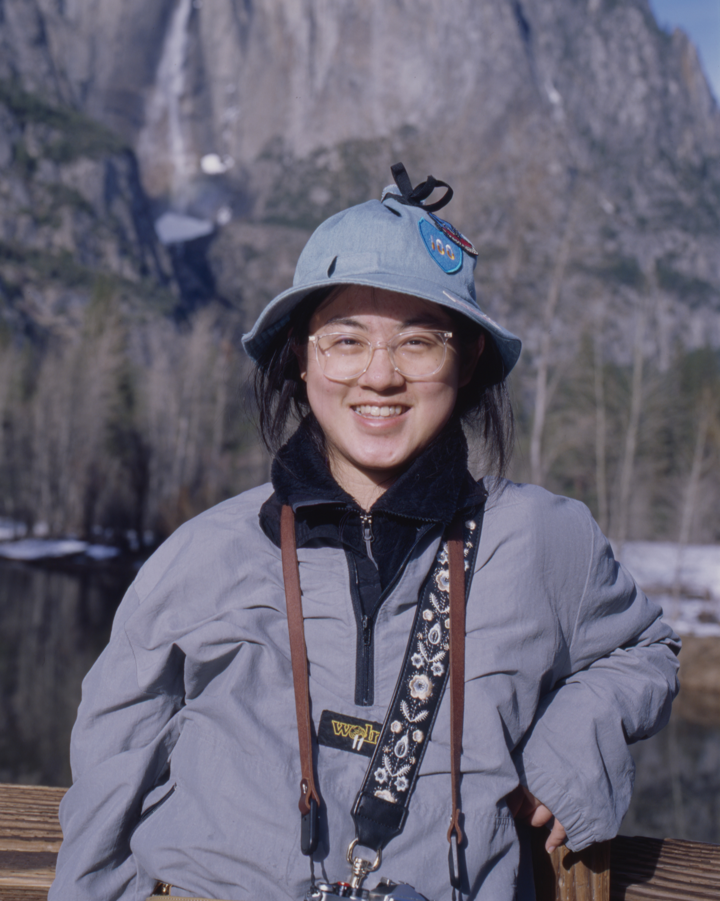

# ECE 5755: Modern Computer Architecture and Systems (Fall 2024)

## Description

This graduate level course is designed to provide a hardware-centric overview
of computer systems used in modern computing platforms. From the bottom up we
will study the architecture of processor architectures (e.g., pipelined CPUs,
ISA, RISC vs. CISC, out-of-order execution) and memory systems (e.g., memory
hierarchy, caching, DRAM memories). We will understand how to evaluate the
performance of modern processors and exploit parallelism in applications. This
includes parallelization across multi-core CPUs, GPUs, and specialized
hardware. Through hands-on assignments and an open-ended project students will
develop a holistic understanding of modern computer systems and how they are
designed.

## Logistics

- Room: Bloomberg Center 71 (Cornell Tech)
- Time: Mondays and Wednesdays at 10:10am - 11:25am
- Please read the [syllabus](https://docs.google.com/document/d/1KOVxBbWcwsVbuoAC8NWIuc9fU-NF-6CvPUplaWrgDVk/edit)
- [Canvas link](https://canvas.cornell.edu/courses/67788)
- [Ed Discussions](https://edstem.org/us/join/uHMmF9)

## Course Staff

|  |  |  |  |
| :-------------:                                                          | :-------------:                                    | :-------------:                                       | :------------: |
| Udit Gupta (Professor)                                                   | Collin Zhang (Head TA)                             | Zhanqiu Hu (Grader/TA)                                | Zhilin He (Grader) |

## Office Hours

- Professor: Wednesday, 12pm - 1pm, Bloomberg 268
- TA (Collin Zhang): Tuesday, 11am - 12pm
- TA (Zhanqiu Hu): Thursday, 10am - 11am

## Schedule

| Date   | Day | Topic                                                                                                                                                                                   | Due                                                                                                                 |
| ------ | --- | -------------------------------------                                                                                                                                                   |                                                                                                                     |
| Aug 26 | Mon | [Introduction to Architecture and Systems](https://docs.google.com/presentation/d/1C7ipAEQI2Jd8PVvROCqXL_wisniyxAa9/edit?usp=drive_link&ouid=103169723489519509705&rtpof=true&sd=true)  |                                                                                                                     |
| Aug 28 | Wed | [Instruction Set Architecture](https://docs.google.com/presentation/d/1W8znJ-litE9ozRRCUYS4QVWf6OcQ0qu2/edit?usp=drive_link&ouid=103169723489519509705&rtpof=true&sd=true)              |                                                                                                                     |
| Sep 2  | Mon | Labor day (No class)                                                                                                                                                                    |                                                                                                                     |
| Sep 4  | Wed | [Processors](https://docs.google.com/presentation/d/1nCmCjAGrhryLLPhwOlQpPuhjMAoNMRRz/edit?usp=drive_link&ouid=103169723489519509705&rtpof=true&sd=true)                                |                                                                                                                     |
| Sep 9  | Mon | [Pipelined Processors](https://docs.google.com/presentation/d/1al7hMZz0tXEaQDfXR1FECcxqzErQbNeT/edit#slide=id.p58)                                                                      | [Quiz I](https://docs.google.com/presentation/d/1MdExRuPRSrTruy7vzI6CKvMfyTNEMKMlZ4YSqaovHyA/edit?usp=drive_link)   |
| Sep 11 | Wed | [Pipelined Processors 2](https://docs.google.com/presentation/d/1KD1dj9dybmVeH_4elcvg4nHF5mrnbr25/edit?usp=drive_link&ouid=103169723489519509705&rtpof=true&sd=true)                    |                                                                                                                     |
| Sep 16 | Mon | [Speculation](https://docs.google.com/presentation/d/1Jtd-ohnEG4CAPApaHmHSPUEyMkGJ7iPi/edit?usp=drive_link&ouid=103169723489519509705&rtpof=true&sd=true)                               |                                                                                                                     |
| Sep 18 | Wed | [Out of order execution](https://docs.google.com/presentation/d/1yCgWcP-ZUsDigPlKIQJgviYPy4ZlL5Qp/edit?usp=drive_link&ouid=103169723489519509705&rtpof=true&sd=true)                    |                                                                                                                     |
| Sep 23 | Mon | [Out of order execution & Memory Hierarchy](https://docs.google.com/presentation/d/1s07BapSqa3waeBbzPWq3NvF4NXqcbyHw/edit?usp=drive_link&ouid=103169723489519509705&rtpof=true&sd=true) | Quiz II (in class)                                                                                                  |
| Sep 25 | Wed | [Caching I](https://docs.google.com/presentation/d/1RrKjOp3M6KafUdwQyb0ayD8Ho1i9IKn1/edit?usp=drive_link&ouid=103169723489519509705&rtpof=true&sd=true)                                 | Lab 0 due                                                                                                           |
| Sep 30 | Mon | [ML](https://docs.google.com/presentation/d/1Q9HGtqsPc31yu6OLhyoGsa98piqoaGb7/edit?usp=drive_link&ouid=103169723489519509705&rtpof=true&sd=true)                                        |                                                                                                                     |
| Oct 2  | Wed | [Caching II](https://docs.google.com/presentation/d/1d1WE-nslGraedFn3HXo0F37AW6fbU193/edit?usp=drive_link&ouid=103169723489519509705&rtpof=true&sd=true)                                |                                                                                                                     |
| Oct 7  | Mon | [Caching & VM](https://docs.google.com/presentation/d/1v1Q0XA57e0iwf81ti0r7_tMDx4Y5K5Cz/edit?usp=drive_link&ouid=103169723489519509705&rtpof=true&sd=true)                              |                                                                                                                     |
| Oct 9  | Wed | [VM](https://docs.google.com/presentation/d/1ezUljYiQOBxM-VABAjbpqcaFskQeVQh8/edit?usp=drive_link&ouid=103169723489519509705&rtpof=true&sd=true)                                        | Lab 1 due                                                                                                           |
| Oct 16 | Wed | [DRAM](https://docs.google.com/presentation/d/19EMfCucakbwRrpBrMDs8d7pPUeHaQUnn/edit?usp=drive_link&ouid=103169723489519509705&rtpof=true&sd=true)                                      |                                                                                                                     |
| Oct 21 | Mon | [Multi-core & Cache Coherence](https://docs.google.com/presentation/d/1QyL0vPbJHLrjOhZqoycpmQu7FzKDKxtZ/edit?usp=drive_link&ouid=103169723489519509705&rtpof=true&sd=true)              | [Quiz III](https://docs.google.com/presentation/d/18O1n3kxdlLwx8rcQiieBTy7HPwGfCrMVzohHbyQIPFc/edit?usp=drive_link) |
| Oct 23 | Mon | [Cache Coherence](https://docs.google.com/presentation/d/17vv7k5zpBUzVt1cxX7YIyE__UfgwNIiL/edit?usp=drive_link&ouid=103169723489519509705&rtpof=true&sd=true)                           |                                                                                                                     |
| Oct 28 | Mon | [Memory Consistency](https://docs.google.com/presentation/d/1RkCTm_n4-0evBudt0jDAl3pyWBO9pygT/edit?usp=drive_link&ouid=103169723489519509705&rtpof=true&sd=true)                        | [Quiz IV](https://docs.google.com/presentation/d/1QRXQF-2QTUwsveuSnZBkZPTecUYM1jmQG5prNTgRwto/edit#slide=id.p)      |
| Oct 30 | Wed | [Memory Consistency](https://docs.google.com/presentation/d/14gcD_hg64XyAoE88t_4r4CY-0wWkBk55/edit?usp=drive_link&ouid=103169723489519509705&rtpof=true&sd=true)                        | Lab 2 due                                                                                                           |
| Nov 4  | Mon | Group Presentations I                                                                                                                                                                   |                                                                                                                     |
| Nov 6  | Wed | [GPU's](https://docs.google.com/presentation/d/1BYm7-n_UCBPAqlPf4P4odnYtQeQ1v17o/edit?usp=drive_link&ouid=103169723489519509705&rtpof=true&sd=true)                                     |                                                                                                                     |
| Nov 11 | Mon | [GPU's & Heterogeneous Computing](https://docs.google.com/presentation/d/13smxDPULD6XkznoOXYCSXQumA5YjLBks/edit?usp=drive_link&ouid=103169723489519509705&rtpof=true&sd=true)           | Lab 3 due                                                                                                           |
| Nov 13 | Wed | [Heterogeneous Computing](https://drive.google.com/file/d/1fXtZ8GpKftEzeVQl3fQ0v91a6kHjP4sX/view?usp=drive_link)                                                                        | Quiz VI (cache coherence)                                                                                           |
| Nov 18 | Mon | [Heterogeneous Computing & Datacenters](https://drive.google.com/file/d/14IE0b4o1QRSdj4IH_Wtvtq1VMF264XTN/view?usp=drive_link)                                                                        | Quiz VII (memory consistency)                                                                                           |
| Nov 20 | Wed | [Datacenters](https://docs.google.com/presentation/d/12o0Ih1fwEFCgXA1eo7q41gTDqTCM9GGK/edit?usp=drive_link&ouid=103169723489519509705&rtpof=true&sd=true)                                                                                                                                                                                        | Lab 4 due (Nov 22)                                                                                                  |
| Nov 25 | Mon |                                                                                                                                                                                         | Quiz VIII (GPU's & Heterogeneous Computing)                                                                                                   |
| Nov 27 | Wed | Thanksgiving (no class)                                                                                                                                                                 |                                                                                                                     |
| Dec 2  | Mon | Group Presentations II                                                                                                                                                                  |                                                                                                                     |
| Dec 4  | Wed | Group Presentations III                                                                                                                                                                 | Lab 5 due                                                                                                           |
